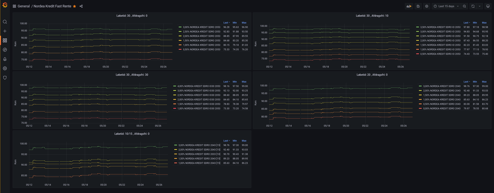

# Nordea Rate Metrics

This is an application I wrote to get data on Nordea's bonds rates and export as Prometheus metrics. On [Nordea's website](https://www.nordea.dk/privat/produkter/boliglaan/Kurser-realkreditlaan-kredit.html) you can get a table with the current bond rates, but you cannot get a graph of the rate over time.

An OCI image is available at <https://hub.docker.com/r/kerwood/nordea-rate-metrics/tags>

Included in this repository is a Docker Compose file to spin up the appilcation with Prometheus and Grafana. Included are the dashboard below. You dont have to configure anything. Just run `docker-compose up -d` and log into Grafana with the default `admin:admin` on `localhost:3000`.

A `docker-compose-with-traefik.yml` file is also available, which contains the same docker-compose setup but with my default Trafik setup.

